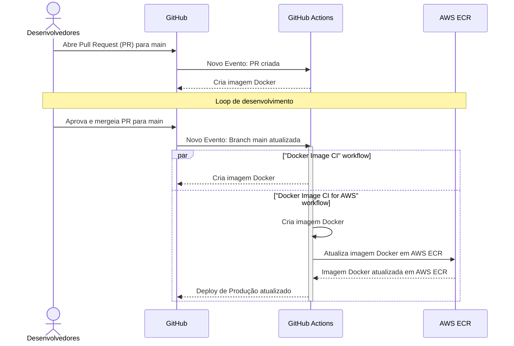

# mentores-backend

Projeto Opensource que visa melhorar o match entre Mentores e Juniors.

## Observação:

>Antes de iniciar a instalação, lembre-se de fazer um fork do repositório oficial e realizar as alterações no repositório "forkado" enviando modificações através de Pull Requests. Nunca modifique diretamente o repositório oficial.


Clone o projeto:

```bash
  git clone https://github.com/{SEU USUARIO}/mentores-backend.git
```

Entre no diretório do projeto:

```bash
  cd mentores-backend/
```

Instale as dependências:

```bash
  npm install
```

## Rodando localmente

- Verifique se esta com o docker instalado e aberto

Dentro da pasta mentores-backend, rode o seguinte comando:

```bash
docker-compose up -d
```

com o banco de dados rodando localmente, só precisa pegar as variaveis .env com alguem do projeto.

## Como utilizar o mailtrap.

Entre no [Mailtrap](https://mailtrap.io) e crie uma conta, com a conta criada vá em email Testing e clique em my inbox:


Veja a parte de Integration e clique em Show Credentials, vai precisar do Host, Port, Username e Password.


Agora só utilizar o:

```bash
npm run dev
```

### Mailtrap não capturou o email

Caso você tenha feito isso tudo e não recebeu o email no mailtrap faça o seguinte, Na pasta do mentores-backend vá em:

src/modules/mails/mail.module.ts

dentro dela tem um: 

```bash
secure: true,
```


troque para false, com isso o mailtrap vai capturar seus emails normalmente.

## DevOps

> [!WARNING]
> GitHub workflow de CI sendo executado ao fazer push para main, duplicando validação que foi feita na PR antes do merge

> [!TIP]
> Atualizar "Docker Image CI" workflow, removendo "on: push: branches: [main]"


